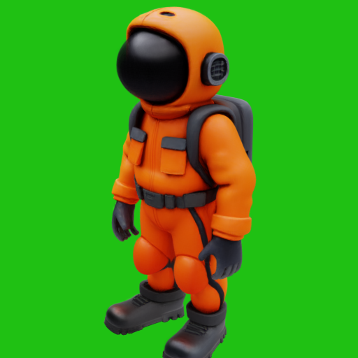
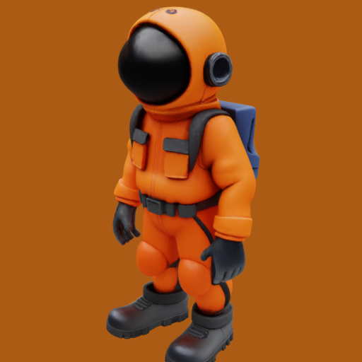
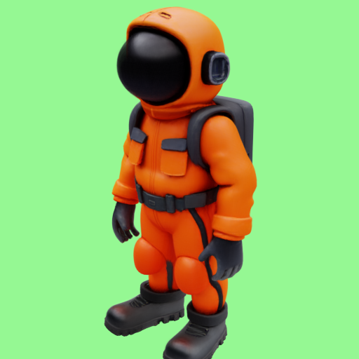

# ComfTrellis

A ComfyUI implementation of [TRELLIS](https://trellis3d.github.io/) - a powerful 3D asset generation model that converts images into 3D assets.


## Requirements

- ComfyUI
- CUDA124-capable GPU with at least 8GB VRAM
- Python 3.10

## Installation

### Quick Install
Simply clone this repository into your ComfyUI's `custom_nodes` folder and launch ComfyUI:

```bash
cd custom_nodes
git clone https://github.com/yourusername/ComfTrellis.git
```

### Manual Install
If the quick install doesn't work, you can run the setup script:

```bash
cd ComfTrellis
python setup.py install
```

### Results

<p align="center">
  <video width="400" controls>
    <source src="assets/singleView.mp4" type="video/mp4">
  </video>
</p>
<p align="center">
  <video width="400" controls>
    <source src="assets/MultiView_VS_SingleView.mp4" type="video/mp4">
  </video>
</p>

## Example Workflows

LowQuality_SingleView & HighQuality_SingleView

<p float="left">
  
  
</p>

LowQuality_MultiView & HighQuality_MultiView

<p float="left">
  
  
</p>


## Nodes

This implementation provides several nodes for working with TRELLIS:

- **Load Trellis Model**: Donwloads and Loads the TRELLIS model for inference
- **Trellis Inference**: Converts images into 3D assets with various parameters for control
- **Save GLB File**: Exports the generated 3D model to GLB format with customizable settings
- **Remove Background (Square)**: Preprocesses images by removing backgrounds and making them square
- **Multi Image Batch**: Combines multiple images for multi-view 3D generation

## Model Details

This implementation is based on Microsoft's TRELLIS project, which offers:

- 3D asset generation from images
- Multiple output formats (Radiance Fields, 3D Gaussians, meshes)
- Support for both single and multi-image inputs

For more details about the underlying model, visit the [TRELLIS project page](https://trellis3d.github.io/).


## Credits

This is a ComfyUI implementation of [TRELLIS](https://github.com/microsoft/TRELLIS) by Microsoft Research. Please refer to their repository for the original implementation and research paper.